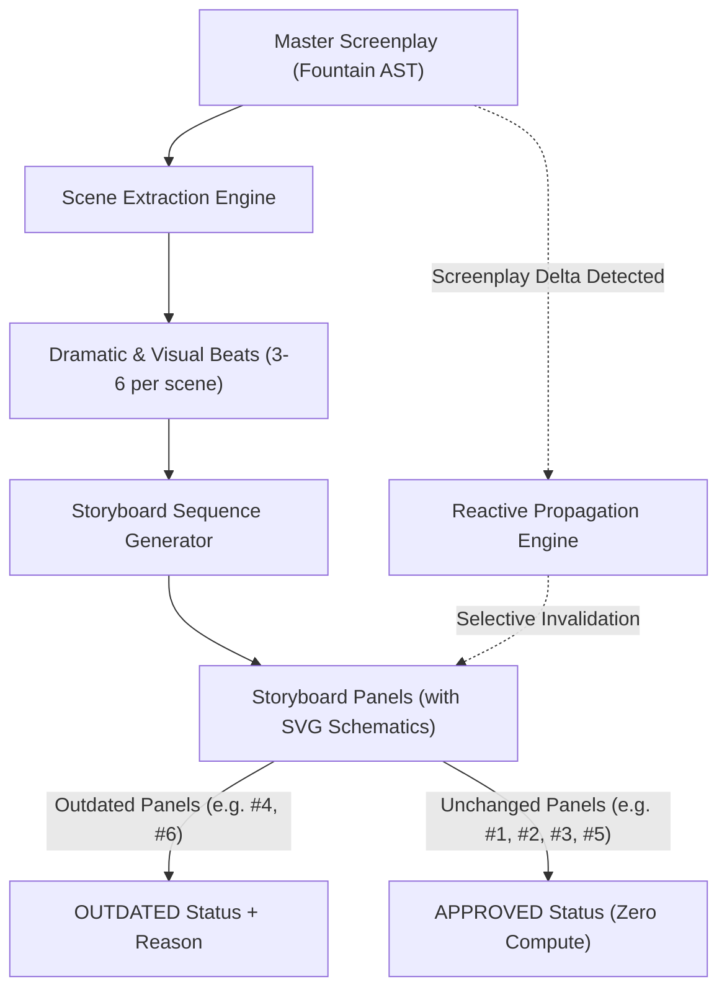

# Scene Comic & Visual Script Architecture

**System**: Scene $\to$ Beats $\to$ Shots $\to$ Storyboard / Comic Pipeline  
**Module**: `packages/production-engine/` & `src/components/SceneComicPanel.tsx`  
**Status**: Production Complete & Verified  

---

## 1. Architectural Overview

The **Scene Comic** is the visual bridge between literary intent (the screenplay) and visual execution (cinematography, blocking, and editing). In legacy workflows, storyboards are created once as static sketches in Photoshop or Storyboard Pro, and immediately become detached from the evolving screenplay. When Scene 1 is rewritten on set, the storyboards are thrown out or ignored.

Scribe Studio solves this with a **Deterministic Screenplay-Rooted Comic Graph**:

---

## 2. Core Pipeline Components

### Phase 1: Scene Extraction (`packages/production-engine/src/sceneExtraction.ts`)
The extraction engine analyzes screenplay text and derives rich semantic metadata:
- **Dramatic Objective**: Central purpose of the scene (e.g., *"Infiltrate Cyber Vault 7 and extract encrypted Obsidian Drive"*).
- **Core Conflict**: Obstacle opposing the objective.
- **Beat Segmentation**: Subdivides the scene into 3–6 distinct dramatic beats based on dialogue exchanges, character entrances/exits, and action punctuation.
- **Entity Classification**: Automatically extracts characters present, spoken dialogue, props mentioned, emotional trajectory, and estimated duration in seconds.

### Phase 2: Storyboard Sequence Generation (`packages/production-engine/src/storyboardGenerator.ts`)
Transforms beats into a `StoryboardSequence` containing a series of `StoryboardPanel` models:
- **Shot Sizing Strategy**: Assigns professional cinematic shot sizes (`establishing`, `wide`, `medium`, `two-shot`, `close-up`, `insert`, `over-shoulder`) based on emotional intensity and story significance.
- **Lens & Angle Mapping**: Recommends focal length (e.g., `24mm Anamorphic` for master, `85mm Macro` for inserts) and camera angle (`low-angle`, `eye-level`, `dutch-angle`).
- **Dialogue & Caption Bubbles**: Maps spoken lines to comic dialogue bubbles (`speech`, `thought`, `caption`, `off-screen`, `shout`).
- **Deterministic SVG Schematic Engine**: Procedurally draws an SVG concept schematic showing camera frustum cone, stage perspective grid, character silhouettes with names, prop markers, and speech bubbles. **Requires 0ms external API latency and works 100% offline.**

### Phase 3: Selective Invalidation & Blast Radius Propagation (`packages/continuity-engine/src/propagationEngine.ts`)
When the screenwriter edits a scene in Scribe Studio:
1. The **Line Diff Engine** locates the exact line modifications.
2. The **Propagation Engine** identifies which panels in the comic depend on the modified lines or affected props/characters.
3. **Selective Status Update**:
   - Only panels whose dialogue or action was altered are marked `OUTDATED` with an explicit `invalidationReason`.
   - All unaffected panels remain `APPROVED` or `LOCKED`.
4. **Zero Wasted Compute**:
   - A single-click "Update Stale Panels" regenerates **only** the 1 or 2 affected panels.
   - Panels 1, 2, 3, and 5 retain their approved framing and blocking, saving 80%+ of regeneration compute and preserving human directorial decisions.

---

## 3. UI Layout Modes in `SceneComicPanel.tsx`

The Scene Comic Studio supports 7 dedicated layout modes tailored to different stages of production:

1. **1-Panel (Spotlight View)**: Ultra-large single-frame inspection with full rule-of-thirds framing grid and detailed inspector.
2. **2-Panel (Dual-Beat)**: Perfect for analyzing shot-reverse-shot dialogue rhythms between actors.
3. **3-Panel (Triptych)**: Classic Three-Act visual progression (Beginning Setup $\to$ Climax Conflict $\to$ Resolution).
4. **4-Panel (2x2 Grid)**: Compact quadrant review for fast pacing assessment.
5. **6-Panel (Graphic Novel)**: Standard comic book 3x2 page layout, showing a complete scene's dramatic arc at a glance.
6. **Webtoon Strip (Vertical Scroll)**: Continuous vertical strip layout ideal for mobile director viewing and pacing rhythm.
7. **Contact Sheet**: Dense multi-panel thumbnail view for production meetings, call sheets, and print export.

---

## 4. Verification & Test Coverage

The Scene Comic pipeline is backed by automated tests in `tests/sceneExtractionAndComic.test.ts`:
- `extractScene` parses beats, characters, objectives, and breakdown items.
- `generateStoryboardSequence` produces valid panels with SVG markup and camera cones.
- `generatePanelSvgSchematic` generates communicative silhouettes, camera cones, and dialogue bubbles.
- `Selective Invalidation`: Editing Scene 1 invalidates only panels mentioning the modified asset, while unaffected panels remain `APPROVED`.
- `Story Threads`: Integrates with overarching narrative arcs across scenes.
